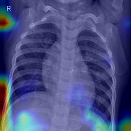
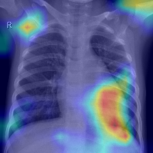
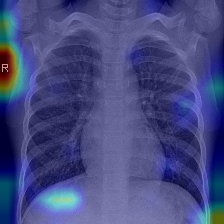
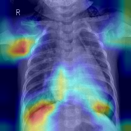
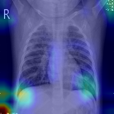
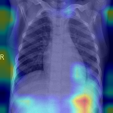
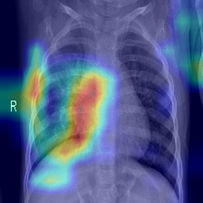
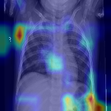
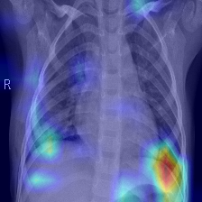
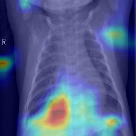

# Failure gallery (A-3)

The 10 worst-confidence errors on the `test` split, method: `gradcam`.
Generated by `xai_cxr.audits.failure_gallery.build_failure_gallery` — regenerate after any retrain rather than editing by hand.

## Case 1: `test/PNEUMONIA/person154_bacteria_728.jpeg`

False negative: true label PNEUMONIA, predicted NORMAL at 99.9% confidence in the predicted class.

## Case 2: `train/PNEUMONIA/person1488_virus_2593.jpeg`

False negative: true label PNEUMONIA, predicted NORMAL at 97.3% confidence in the predicted class.

## Case 3: `train/PNEUMONIA/person485_bacteria_2049.jpeg`

False negative: true label PNEUMONIA, predicted NORMAL at 96.7% confidence in the predicted class.

## Case 4: `train/PNEUMONIA/person815_bacteria_2726.jpeg`

False negative: true label PNEUMONIA, predicted NORMAL at 96.4% confidence in the predicted class.

## Case 5: `train/PNEUMONIA/person1431_bacteria_3698.jpeg`

False negative: true label PNEUMONIA, predicted NORMAL at 93.5% confidence in the predicted class.

## Case 6: `train/PNEUMONIA/person301_virus_622.jpeg`

False negative: true label PNEUMONIA, predicted NORMAL at 92.7% confidence in the predicted class.

## Case 7: `train/PNEUMONIA/person701_bacteria_2600.jpeg`

False negative: true label PNEUMONIA, predicted NORMAL at 91.8% confidence in the predicted class.

## Case 8: `train/PNEUMONIA/person707_virus_1305.jpeg`

False negative: true label PNEUMONIA, predicted NORMAL at 90.8% confidence in the predicted class.

## Case 9: `train/PNEUMONIA/person362_bacteria_1652.jpeg`

False negative: true label PNEUMONIA, predicted NORMAL at 89.1% confidence in the predicted class.

## Case 10: `train/PNEUMONIA/person33_bacteria_175.jpeg`

False negative: true label PNEUMONIA, predicted NORMAL at 88.5% confidence in the predicted class.
