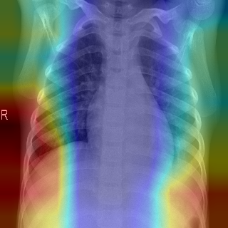
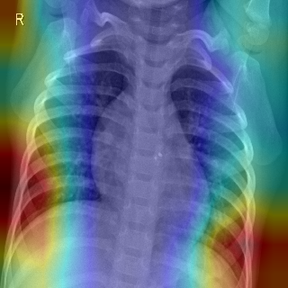
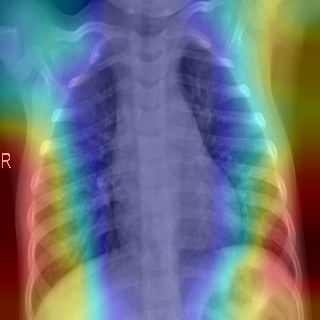
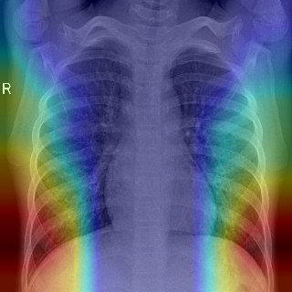
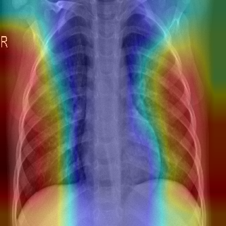
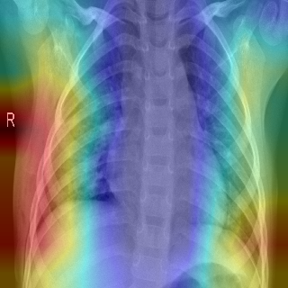
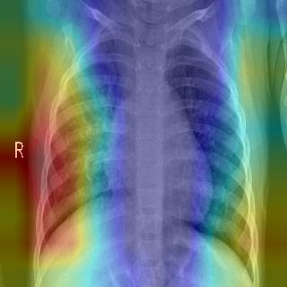
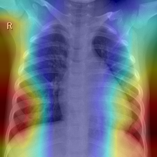
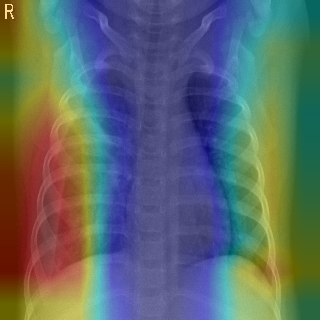
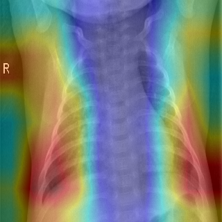

# Failure gallery (A-3)

The 10 worst-confidence errors on the `test` split, method: `gradcam`.
Generated by `xai_cxr.audits.failure_gallery.build_failure_gallery` — regenerate after any retrain rather than editing by hand.

## Case 1: `train/PNEUMONIA/person301_virus_622.jpeg`

False negative: true label PNEUMONIA, predicted NORMAL at 97.5% confidence in the predicted class.

## Case 2: `test/PNEUMONIA/person154_bacteria_728.jpeg`

False negative: true label PNEUMONIA, predicted NORMAL at 97.2% confidence in the predicted class.

## Case 3: `train/PNEUMONIA/person1480_virus_2566.jpeg`

False negative: true label PNEUMONIA, predicted NORMAL at 96.6% confidence in the predicted class.

## Case 4: `train/PNEUMONIA/person485_bacteria_2049.jpeg`

False negative: true label PNEUMONIA, predicted NORMAL at 94.4% confidence in the predicted class.

## Case 5: `train/PNEUMONIA/person1156_virus_1936.jpeg`

False negative: true label PNEUMONIA, predicted NORMAL at 92.3% confidence in the predicted class.

## Case 6: `train/PNEUMONIA/person362_bacteria_1652.jpeg`

False negative: true label PNEUMONIA, predicted NORMAL at 91.3% confidence in the predicted class.

## Case 7: `train/PNEUMONIA/person701_bacteria_2600.jpeg`

False negative: true label PNEUMONIA, predicted NORMAL at 90.0% confidence in the predicted class.

## Case 8: `train/PNEUMONIA/person1488_virus_2593.jpeg`

False negative: true label PNEUMONIA, predicted NORMAL at 89.3% confidence in the predicted class.

## Case 9: `train/PNEUMONIA/person441_virus_894.jpeg`

False negative: true label PNEUMONIA, predicted NORMAL at 89.3% confidence in the predicted class.

## Case 10: `train/PNEUMONIA/person33_bacteria_175.jpeg`

False negative: true label PNEUMONIA, predicted NORMAL at 85.4% confidence in the predicted class.
